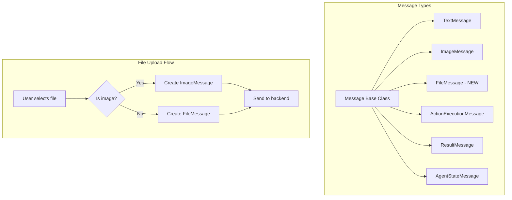

# Design Document: FileMessage Type

## Overview

This feature introduces a new `FileMessage` type to the CopilotKit message system, providing a clear distinction between image uploads (`ImageMessage`) and document/file uploads (`FileMessage`). This separation enables proper handling of different file types on both client and server sides.

## Architecture

The FileMessage type follows the existing message architecture pattern:



## Components and Interfaces

### New Types

#### FileMessageInput (GraphQL Input)

```typescript
@InputType()
export class FileMessageInput {
  @Field(() => String)
  mimeType: string;  // Full MIME type, e.g., "application/pdf"

  @Field(() => String)
  bytes: string;  // Base64-encoded file content

  @Field(() => String)
  fileName: string;  // Original filename

  @Field(() => String, { nullable: true })
  parentMessageId?: string;

  @Field(() => MessageRole)
  role: MessageRole;
}
```

#### FileMessage (Client Class)

```typescript
export class FileMessage extends Message implements FileMessageInput {
  type: MessageType = "FileMessage";
  mimeType: string;
  bytes: string;
  fileName: string;
  role: MessageRole;
  parentMessageId?: string;
}
```

### Modified Components

1. **MessageInput** - Add optional `fileMessage` field
2. **Message Base Class** - Add `isFileMessage()` type guard
3. **Chat.tsx** - Route files to correct message type based on MIME type
4. **Messages.tsx** - Add RenderFileMessage to message rendering

### File Type Detection

```typescript
const isImageMimeType = (mimeType: string): boolean => {
  return mimeType.startsWith("image/");
};
```

## Data Models

### FileMessage Structure

| Field | Type | Description |
|-------|------|-------------|
| id | string | Unique message identifier |
| type | "FileMessage" | Message type discriminator |
| mimeType | string | Full MIME type (e.g., "application/pdf") |
| bytes | string | Base64-encoded file content |
| fileName | string | Original filename |
| role | MessageRole | "user" or "assistant" |
| parentMessageId | string? | Optional parent message reference |
| createdAt | Date | Message creation timestamp |
| status | MessageStatus | Message status |

### Comparison: ImageMessage vs FileMessage

| Aspect | ImageMessage | FileMessage |
|--------|--------------|-------------|
| Use case | Image files | Documents (xlsx, PDF, etc.) |
| format field | Image format (png, jpeg) | N/A |
| mimeType field | N/A | Full MIME type |
| fileName field | N/A | Required |
| bytes field | Base64 image data | Base64 file data |

## Correctness Properties

*A property is a characteristic or behavior that should hold true across all valid executions of a system-essentially, a formal statement about what the system should do. Properties serve as the bridge between human-readable specifications and machine-verifiable correctness guarantees.*

### Property 1: Non-image files create FileMessage
*For any* file with a non-image MIME type (not starting with "image/"), uploading it SHALL result in a FileMessage being created, not an ImageMessage.
**Validates: Requirements 1.1**

### Property 2: Image files create ImageMessage
*For any* file with an image MIME type (starting with "image/"), uploading it SHALL result in an ImageMessage being created, not a FileMessage.
**Validates: Requirements 1.2**

### Property 3: FileMessage contains all required fields
*For any* FileMessage created from a file upload, the message SHALL contain non-empty mimeType matching the original file's MIME type, non-empty bytes, and non-empty fileName.
**Validates: Requirements 1.3, 1.4**

### Property 4: FileMessage type guard correctness
*For any* FileMessage instance, calling isFileMessage() SHALL return true, and for any non-FileMessage instance, isFileMessage() SHALL return false.
**Validates: Requirements 4.2, 4.3**

### Property 5: File icon selection based on MIME type
*For any* FileMessage with xlsx MIME type, the rendered icon SHALL be the spreadsheet icon, and for PDF MIME type, the icon SHALL be the document icon.
**Validates: Requirements 3.3**

## Error Handling

1. **Unknown MIME Type**: Files with unrecognized MIME types default to FileMessage with a generic file icon.

2. **Missing fileName**: If fileName is not provided, use a default name based on MIME type (e.g., "document.pdf").

3. **Empty bytes**: Reject file uploads with empty content before creating a message.

## Testing Strategy

### Property-Based Testing Library
- **fast-check** for TypeScript/JavaScript property-based testing

### Unit Tests
- Test `isImageMimeType()` helper function
- Test FileMessage class instantiation
- Test `isFileMessage()` type guard
- Test file icon selection logic

### Property-Based Tests
Each correctness property will be implemented as a property-based test using fast-check:

1. **Property 1 Test**: Generate random non-image MIME types, verify FileMessage is created
2. **Property 2 Test**: Generate random image MIME types, verify ImageMessage is created
3. **Property 3 Test**: Generate random file data, verify FileMessage structure
4. **Property 4 Test**: Generate mixed message types, verify type guards
5. **Property 5 Test**: Generate xlsx/PDF MIME types, verify correct icons

### Test Configuration
- Property-based tests SHALL run a minimum of 100 iterations
- Each property-based test SHALL be tagged with: `**Feature: file-message, Property {number}: {property_text}**`
