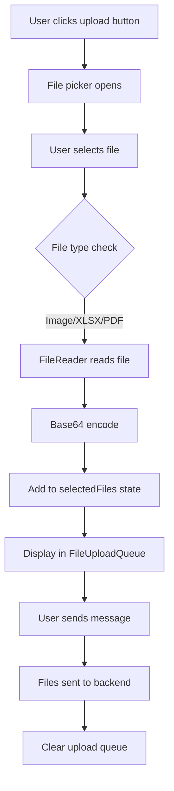

# Design Document: XLSX and PDF File Upload

## Overview

This feature extends the CopilotKit Chat component's existing image upload functionality to support xlsx spreadsheet files and PDF documents. The implementation follows the same base64 encoding pattern already used for images, ensuring consistency and maintainability.

## Architecture

The file upload feature is integrated into the existing CopilotChat component architecture:



## Components and Interfaces

### Modified Components

1. **CopilotChat (Chat.tsx)**
   - Update `inputFileAccept` default value to include xlsx and PDF MIME types
   - Modify `handleFileUpload` to accept all supported file types (not just images)
   - Rename `handleImageUpload` to `handleFileUpload` for clarity
   - Rename `ImageUpload` type to `FileUpload` for semantic accuracy

2. **FileUploadQueue (renamed from ImageUploadQueue)**
   - Update component to display file type indicators for different file types
   - Support rendering xlsx and PDF file previews/icons

### Interface Changes

```typescript
// Updated type (renamed from ImageUpload)
export type FileUpload = {
  contentType: string;  // e.g., "image/png", "application/vnd.openxmlformats-officedocument.spreadsheetml.sheet", "application/pdf"
  bytes: string;        // base64-encoded file content
  fileName?: string;    // optional: original file name for display
};

// Updated props
export interface CopilotChatProps {
  // ... existing props
  
  /**
   * Enable file upload button (supports images, xlsx, and PDF)
   */
  fileUploadsEnabled?: boolean;  // renamed from imageUploadsEnabled
  
  /**
   * The 'accept' attribute for the file input.
   * Defaults to "image/*,.xlsx,.xls,application/vnd.openxmlformats-officedocument.spreadsheetml.sheet,application/vnd.ms-excel,application/pdf".
   */
  inputFileAccept?: string;
}
```

## Data Models

### FileUpload Structure

```typescript
interface FileUpload {
  contentType: string;  // MIME type of the file
  bytes: string;        // Base64-encoded file content
  fileName?: string;    // Original filename (optional, for display)
}
```

### Supported MIME Types

| File Type | MIME Type |
|-----------|-----------|
| Images | `image/*` |
| XLSX | `application/vnd.openxmlformats-officedocument.spreadsheetml.sheet` |
| XLS | `application/vnd.ms-excel` |
| PDF | `application/pdf` |

## Correctness Properties

*A property is a characteristic or behavior that should hold true across all valid executions of a system-essentially, a formal statement about what the system should do. Properties serve as the bridge between human-readable specifications and machine-verifiable correctness guarantees.*

### Property 1: File accept attribute reflects configuration
*For any* inputFileAccept prop value, the file input element's accept attribute SHALL equal that prop value.
**Validates: Requirements 2.1**

### Property 2: Default accept includes all supported types
*For any* CopilotChat component rendered without inputFileAccept prop, the file input's accept attribute SHALL include image/*, xlsx MIME types, and application/pdf.
**Validates: Requirements 2.2**

### Property 3: File encoding produces valid FileUpload structure
*For any* valid file (image, xlsx, or PDF), encoding it SHALL produce a FileUpload object with a non-empty contentType matching the file's MIME type and non-empty base64 bytes.
**Validates: Requirements 1.2, 1.3, 4.1**

### Property 4: Upload queue contains all added files
*For any* sequence of file additions, the upload queue SHALL contain exactly those files in order of addition.
**Validates: Requirements 3.1**

### Property 5: Remove operation removes correct file
*For any* upload queue with n files and valid index i (0 <= i < n), removing at index i SHALL result in a queue of n-1 files with the file at index i removed.
**Validates: Requirements 3.2**

### Property 6: Send clears upload queue
*For any* non-empty upload queue, after sending a message, the upload queue SHALL be empty.
**Validates: Requirements 3.3**

### Property 7: Sent files preserve MIME type
*For any* file sent to the backend, the contentType field SHALL match the original file's MIME type.
**Validates: Requirements 1.4, 4.3**

## Error Handling

1. **File Read Errors**: If FileReader fails to read a file, log the error to console and maintain the current upload queue state unchanged.

2. **Invalid File Types**: The file picker's accept attribute prevents selection of unsupported file types at the browser level.

3. **Empty File Selection**: If no files are selected (user cancels), no action is taken.

## Testing Strategy

### Property-Based Testing Library
- **fast-check** for TypeScript/JavaScript property-based testing

### Unit Tests
- Test file type detection logic
- Test base64 encoding for different file types
- Test upload queue state management (add, remove, clear)
- Test default prop values

### Property-Based Tests
Each correctness property will be implemented as a property-based test using fast-check:

1. **Property 1 Test**: Generate arbitrary accept strings, verify input element reflects them
2. **Property 3 Test**: Generate random file content and types, verify FileUpload structure
3. **Property 4 Test**: Generate sequences of file additions, verify queue state
4. **Property 5 Test**: Generate queues and valid indices, verify removal behavior
5. **Property 6 Test**: Generate non-empty queues, verify clearing after send
6. **Property 7 Test**: Generate files with various MIME types, verify preservation

### Test Configuration
- Property-based tests SHALL run a minimum of 100 iterations
- Each property-based test SHALL be tagged with: `**Feature: xlsx-file-upload, Property {number}: {property_text}**`
